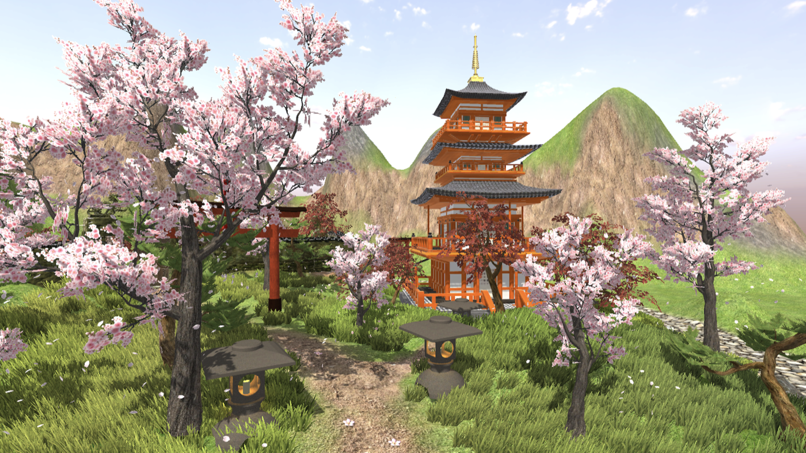
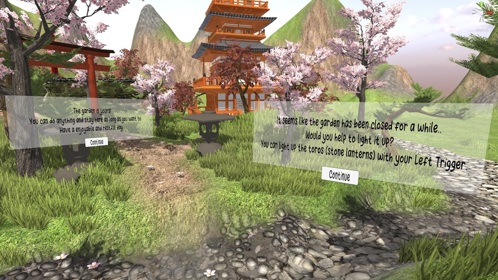
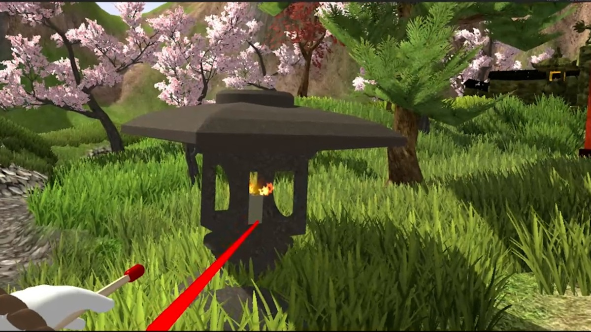
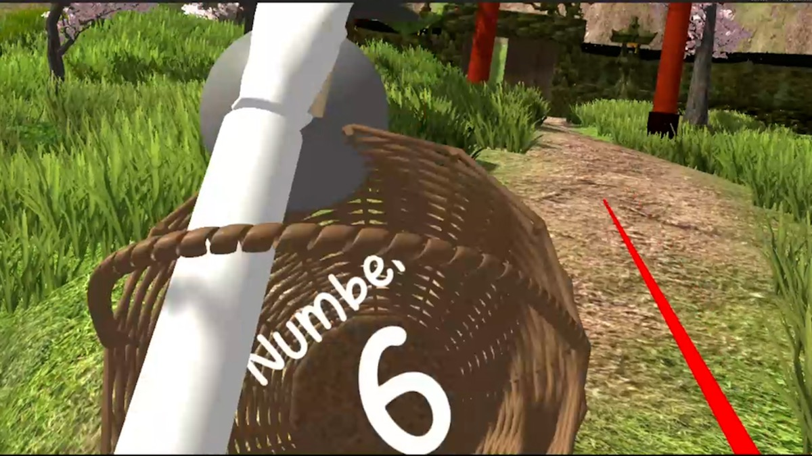
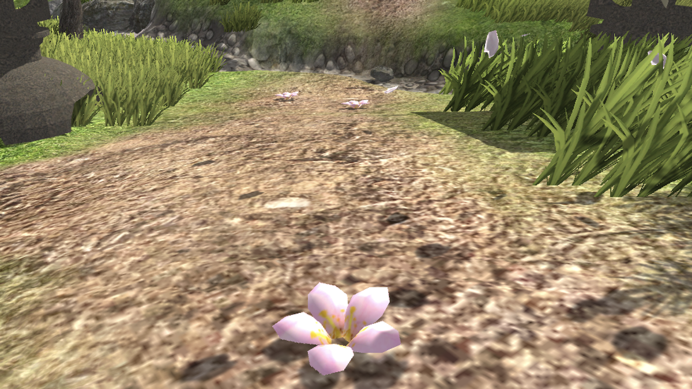
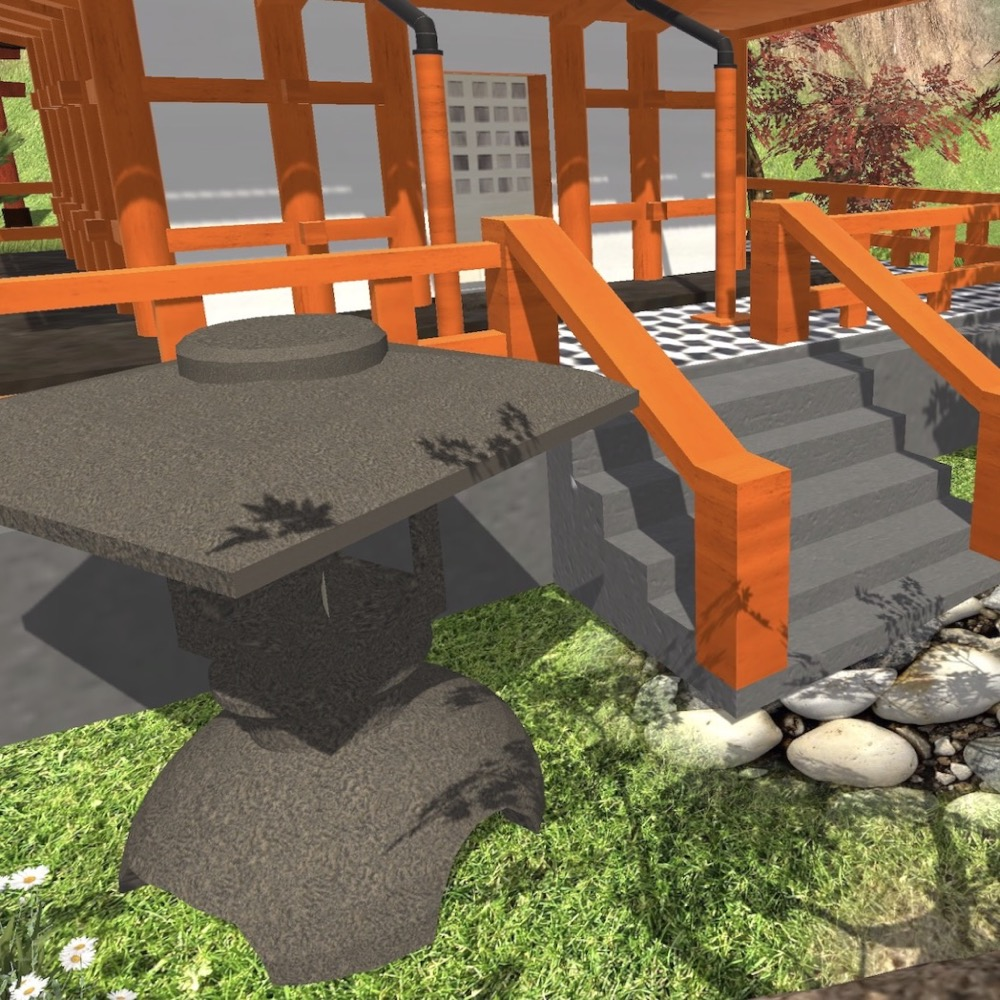

# TORO - VR Japanese Garden Technical Breakdown



TORO is a Unity VR Japanese garden simulation built for Meta Quest 2 as a three-person team project. My work focused on the Unity and C# implementation: XR setup, controller input, ray-based interactions, tutorial flow, object triggers, UI feedback, and scene integration.

## Links

- Full visual case study: https://www.keyingkimi.com/toro
- Original project site: https://game-toro.weebly.com
- Interaction clip: [pick-flower-interaction.gif](media/gifs/pick-flower-interaction.gif)

## My Role

I was responsible for the Unity development and C# implementation. I translated the team's design goals into playable systems, including XR controller setup, ray-based target detection, tutorial UI behavior, collectible triggers, TextMeshPro feedback, and runtime object state changes.

## Tech Stack

- Unity 2021.3.8f1 LTS
- C#
- XR Interaction Toolkit 2.2.0
- Unity Input System 1.4.4
- OpenXR / Oculus XR support
- Universal Render Pipeline
- TextMeshPro
- Unity Physics, colliders, raycasts, tags, and layers

## Core Systems

### XR and Player Setup

Configured the Unity VR scene around XR Origin, controller tracking, interaction layers, and a VR-ready camera/player setup. The project also includes earlier first-person movement prototypes used during development.

### Tutorial Interaction

Implemented controller-driven tutorial dismissal using `InputActionReference` and `Physics.Raycast`, allowing the player to aim at UI-layer targets and advance through the onboarding flow.

Relevant script:

- [`TutorialStart.cs`](src/UnityScripts/TutorialStart.cs)

### Lantern / Candle Interaction

Built raycast-based interaction logic for lighting candles and lanterns. When the player activates a valid target, the system spawns flame feedback at runtime near the hit object.

Relevant script:

- [`HitRayHand.cs`](src/UnityScripts/HitRayHand.cs)

### Collectible and Basket Trigger System

Created the object collection and basket feedback loop using trigger colliders, tag checks, TextMeshPro UI updates, runtime object destruction, spawned flower feedback, and coroutine-based trigger state control.

Relevant scripts:

- [`BasketInteraction.cs`](src/UnityScripts/BasketInteraction.cs)
- [`PickupDebris.cs`](src/UnityScripts/PickupDebris.cs)

## Interaction Pipeline

```text
Controller input
  -> InputActionReference value
  -> Physics.Raycast from controller/camera
  -> Layer or tag validation
  -> Runtime feedback
       - hide tutorial panel
       - instantiate flame
       - update TextMeshPro count
       - destroy collected object
       - spawn visible progress feedback
```

## Selected Screenshots

| Tutorial UI | Lantern lighting | Basket counter |
| --- | --- | --- |
|  |  |  |

| Flower collectible | Garden overview | Lantern/environment detail |
| --- | --- | --- |
|  |  |  |

## Interaction Clip


This clip shows the flower collection interaction in context: the player identifies collectible objects in the scene and connects the action back to the basket feedback loop.

## What I Would Improve in a Production Version

- Replace hard-coded layer integers with named serialized `LayerMask` fields.
- Move repeated raycast interaction logic into reusable interaction components.
- Add object pooling for repeated runtime effects such as flames or particles.
- Separate UI text, interaction state, and gameplay logic into smaller components.
- Add play mode tests for trigger logic and interaction state transitions.
- Improve input abstraction so desktop debug controls and VR controls share clearer interfaces.

## Review Focus

The strongest technical areas to review are the Unity C# scripts, the interaction pipeline, and the way object targeting, UI feedback, and runtime state changes work together inside the VR scene.
